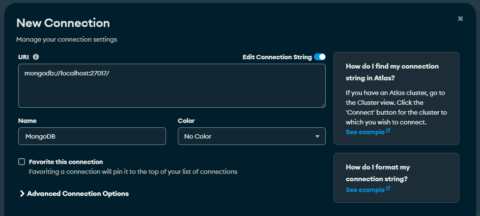
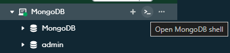

# Projeto 1 - Document Store 

## Requisitos

- MongoDB - [Download](https://www.mongodb.com/try/download/community)
- Bibliotecas
  - `pymongo`
  - `faker`

## Configurando Ambiente

1.  Navegue até a pasta dentro do projeto MongoDB.

2.  Criação da venv:

    ```python
    python -m venv .venv
    ```

3.  Ativar o ambiente:

    ```bash
    # Windows command prompt
    .venv\Scripts\activate.bat

    # Windows PowerShell
    .venv\Scripts\Activate.ps1

    # macOS and Linux
    source .venv/bin/activate
    ```

4.  Instale as dependências:

    ```bash
    pip install -r requirements.txt
    ```


## Criar banco/Se conectar ao console.

1. Executar o MongoDB Compass.

2. Adcionar uma nova conexão:


3. Conectar ao MongoShell:

    

4. Selecionar keyspace:

    ```sql
    use MongoDB
    ```

## Executar o Código

1.  Criar dados:

    ```bash
    python gerador.py
    ```

2.  Injetar dados:

    ```bash
    python injetor.py
    ```

## [Link Queries](/MongoDB/queries.md)


