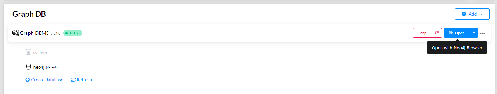

# Projeto 3 - Graph Database

## Requisitos

- Neo4j - [Download](https://neo4j.com/docs/desktop-manual/current/installation/download-installation/)
- Bibliotecas
  - `faker`

## Configurando Ambiente

1.  Navegue até a pasta dentro do projeto Cassandra.

2.  Criação da venv:

    ```python
    python -m venv .venv
    ```

3.  Ativar o ambiente:

    ```bash
    # Windows command prompt
    .venv\Scripts\activate.bat

    # Windows PowerShell
    .venv\Scripts\Activate.ps1

    # macOS and Linux
    source .venv/bin/activate
    ```

4.  Instale as dependências:

    ```bash
    pip install -r requirements.txt
    ```

## Configuração Docker


### Passos

1.  Abra o Neo4j e crie um projeto.

    

2.  Clique em adcionar: `Local DBMS`

    


3.  Abra o neo4j browser.

    


## [Link Queries](/Neo4j/queries.md)
